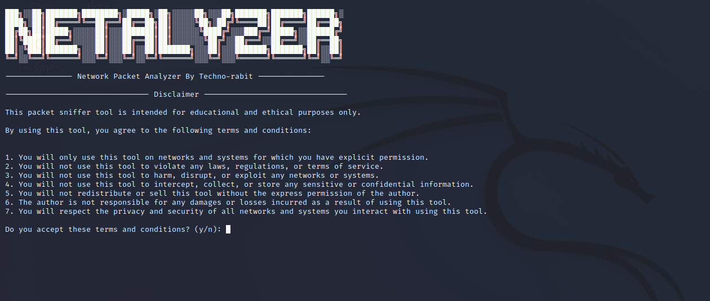

# PRODIGY_CS_05

<p align="center">
<a href="#"></a>
</p>
<p align="center">
<a href="https://github.com/vxnuprasad"></a>
<a href="https://prodigyinfotech.dev/"></a>
</p>

## NETALYZER ( Network Packet Analyzer )

This Python-based network packet analyzer (Packetron) captures and analyzes TCP packets in real time, extracting key details such as IP addresses, ports, and payloads. The tool also ensures ethical usage by displaying a disclaimer before execution.

## Features

- **Packet Sniffing**: Captures TCP packets from the network.
- **Data Extraction**: Extracts source/destination IPs, ports, protocols, and payloads.
- **File Logging**: Saves captured packet details to a text file for analysis.
- **Ethical Disclaimer**: Requires users to accept terms of ethical usage.

## How It Works
### 1. User Agreement: Displays a disclaimer requiring user acceptance before starting.
### 2. Packet Capture: Sniffs TCP packets and extracts relevant information.
### 3. File Output: Saves the captured packet details to "packet_sniffer_results.txt."

## Usage

To use the packet analyzer, run the script, accept the terms, and capture TCP packets in real-time.

### Requirements

Ensure you have the `scapy`, `os`, and `sys` libraries in your Python environment.

Install `scapy`:
```sh
pip install scapy
```

Clone the GitHub Repository:
```sh
git clone https://github.com/vxnuprasad/PACKETRON
```

Run:
```sh
python packetron.py
```

## Contributions

If you find this tool useful, consider following [vxnuprasad](https://github.com/vxnuprasad) on GitHub!

## Find Me on:

[](https://www.linkedin.com/in/vxnuprasad)
[](https://www.instagram.com/__.v.shnu/)
